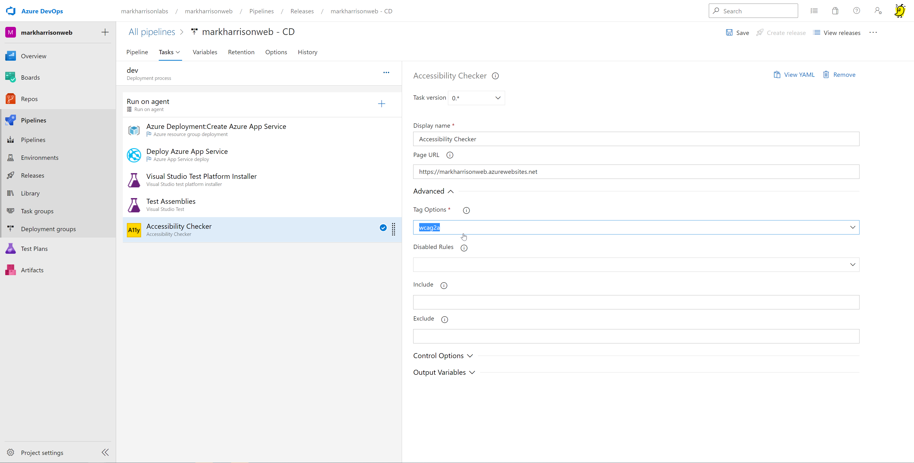
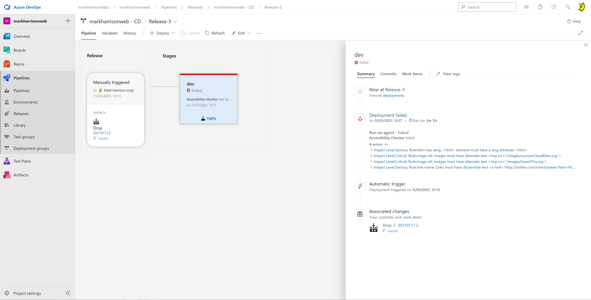
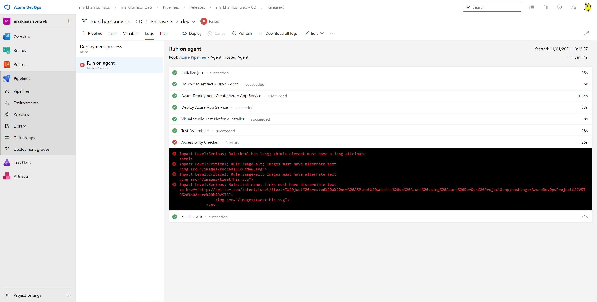

# Azure DevOps - Hands-on Lab Script

Mark Harrison : 26 March 2020 ... updated 11 January 2021

- [Part 1 - Create Project / Application](azuredevops-1.md)
- [Part 2 - Development](azuredevops-2.md)
- [Part 3 - Test Plans](azuredevops-3.md) 
- [Part 4 - Accessibility Testing](azuredevops-4.md) ... this document

## Accessibility Testing

As part of the release pipeline - add the Accessibility Checker - this can be obtained from the Marketplace

[Accessibility Checker](https://marketplace.visualstudio.com/items?itemName=DrewLewis.Accessibility)

The task configuration allows selection of the required standards to be validated against

Now add a User Story to get the detected issues fixed !

---

[Home](README.md) | [Prev](azuredevops-3.md)
